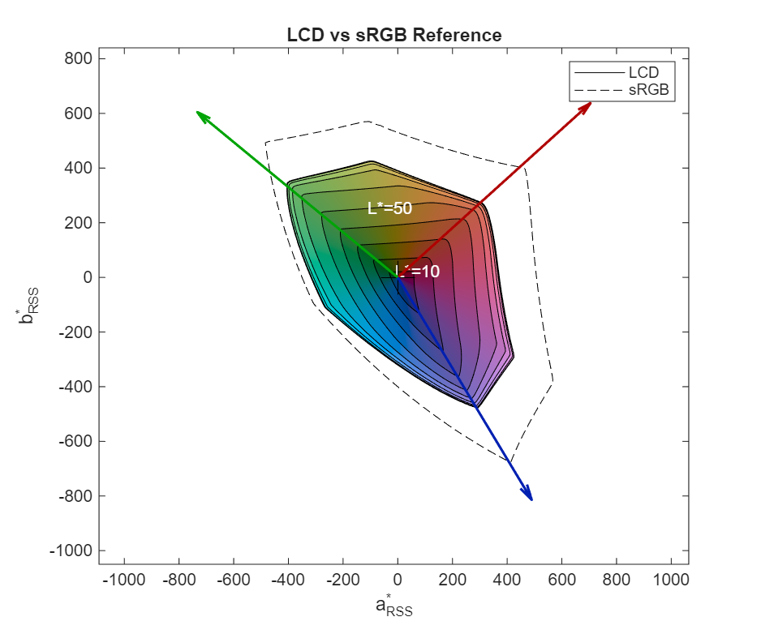

# gamut-volume-m

CIELab gamut volume calculation and visualization in MATLAB/Octave. Measures color capability of display systems by computing the volume of CIELab color space a device can produce.



## Installation

**Using git:**
```bash
git clone https://github.com/CIELab-gamut-tools/gamut-volume-m.git
```

**Without git:** Download the [ZIP file](https://github.com/CIELab-gamut-tools/gamut-volume-m/archive/master.zip) and extract to a folder.

## Quick Start

```matlab
% Load a gamut from a CGATS file
gamut = CIELabGamut('samples/lcd.txt');

% Create a reference gamut
srgb = SyntheticGamut('sRGB');

% Plot gamut rings with reference
PlotRings(gamut, srgb);
legend('LCD gamut', 'sRGB gamut');

% Calculate coverage percentage
intersection = IntersectGamuts(gamut, srgb);
coverage = GetVolume(intersection) / GetVolume(srgb);
title(sprintf('LCD gamut, sRGB coverage = %.0f%%', coverage * 100));
```

## Core Functions

| Function | Description |
|----------|-------------|
| `CIELabGamut` | Load gamut from CGATS file or RGB/XYZ matrices |
| `SyntheticGamut` | Generate reference gamuts (sRGB, BT.2020, DCI-P3) |
| `GetVolume` | Calculate gamut volume |
| `IntersectGamuts` | Compute intersection of two gamuts |
| `PlotRings` | 2D gamut rings visualization |
| `PlotVolume` | 3D surface visualization |

## Documentation

Full documentation is available in the [`docs/`](docs/index.md) folder:

- [Getting Started Guide](docs/getting-started.md)
- [Function Reference](docs/index.md#function-reference)
- [CGATS File Format](docs/guides/cgats-file-format.md)

## Testing

```matlab
runtests('tests');
```

## License

See [LICENSE](LICENSE) for details.
