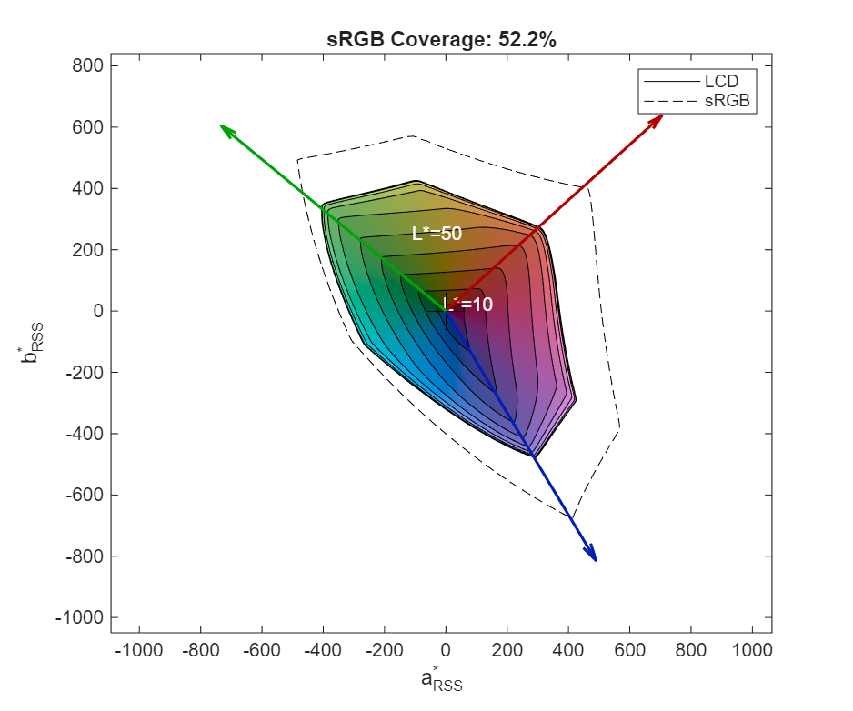

# IntersectGamuts

Calculate the intersection of two gamut volumes.

## Syntax

```matlab
gamut = IntersectGamuts(gamut1, gamut2)
```

## Description

`IntersectGamuts` computes the overlapping region of two gamuts. The result can be used for:
- Calculating coverage percentages
- Plotting intersection rings
- Further intersection operations

## Input Arguments

| Argument | Description |
|----------|-------------|
| `gamut1` | First gamut object |
| `gamut2` | Second gamut object |

Both arguments must be gamut objects from `CIELabGamut`, `SyntheticGamut`, or previous `IntersectGamuts` calls.

## Return Value

Returns a gamut object representing the intersection. This object can be used with:
- `GetVolume` - Calculate intersection volume
- `PlotRings` - Visualize intersection
- `IntersectGamuts` - Further intersections

**Note:** The intersection object does *not* contain surface tessellation data, so it cannot be used with `PlotVolume`.

## Examples

### Calculate Coverage Percentage

```matlab
% Load test gamut
gamut = CIELabGamut('samples/lcd.txt');

% Create reference
ref = SyntheticGamut('sRGB');

% Calculate intersection
intersection = IntersectGamuts(gamut, ref);

% Coverage = intersection / reference
coverage = GetVolume(intersection) / GetVolume(ref);
fprintf('sRGB coverage: %.1f%%\n', coverage * 100);
```

### Compare Multiple References

```matlab
gamut = CIELabGamut('samples/lcd.txt');

refs = {'sRGB', 'DCI-P3', 'BT.2020'};
for i = 1:length(refs)
    ref = SyntheticGamut(refs{i});
    intersection = IntersectGamuts(gamut, ref);
    coverage = GetVolume(intersection) / GetVolume(ref);
    fprintf('%s coverage: %.1f%%\n', refs{i}, coverage * 100);
end
```

### Visualize Coverage

```matlab
gamut = CIELabGamut('samples/lcd.txt');
ref = SyntheticGamut('sRGB');
intersection = IntersectGamuts(gamut, ref);

coverage = GetVolume(intersection) / GetVolume(ref) * 100;

figure;
PlotRings(gamut, ref);
title(sprintf('sRGB coverage: %.0f%%', coverage));
```



### Intersection of Three Gamuts

```matlab
g1 = SyntheticGamut('sRGB');
g2 = SyntheticGamut('DCI-P3');
g3 = SyntheticGamut('BT.2020');

% sRGB is entirely within both larger gamuts
i12 = IntersectGamuts(g1, g2);
i123 = IntersectGamuts(i12, g3);

fprintf('sRGB volume: %g\n', GetVolume(g1));
fprintf('sRGB ∩ DCI-P3 ∩ BT.2020: %g\n', GetVolume(i123));
```

### Plot Intersection Rings

Use `PlotRings` with `IntersectionPlot` for visual comparison:

```matlab
PlotRings(SyntheticGamut('sRGB'), SyntheticGamut('BT.2020'), ...
    'IntersectionPlot', true);
```

## Notes

- Both gamuts must have the same cylindrical map dimensions (Lsteps, hsteps)
- The default is 100 L* steps and 360 hue steps
- The intersection is computed per (L*, hue) cell

## See Also

- [CIELabGamut](CIELabGamut.md) - Load gamut data
- [SyntheticGamut](SyntheticGamut.md) - Generate reference gamuts
- [GetVolume](GetVolume.md) - Calculate volumes
- [PlotRings](PlotRings.md) - Visualize gamuts
