# PlotRings

Create a 2D gamut rings visualization.

## Syntax

```matlab
PlotRings(gamut);
PlotRings(gamut, refGamut);
PlotRings(gamut, refGamut1, refGamut2);
PlotRings(___, 'parameter', value, ...);
```

## Description

`PlotRings` creates a polar-style plot showing gamut boundaries at different L* (lightness) levels. This is the standard way to visualize and compare color gamuts.

## Input Arguments

| Argument | Description |
|----------|-------------|
| `gamut` | Primary gamut to plot |
| `refGamut` | Optional reference gamut (shown as dashed outer ring) |
| `refGamut2` | Optional second reference gamut |

All gamut arguments must be objects from `CIELabGamut`, `SyntheticGamut`, or `IntersectGamuts`.

---

## General Parameters

### Axes

| Parameter | Description | Default |
|-----------|-------------|---------|
| `Axes` | Axes handle for the plot | `gca` |
| `ClearAxes` | Clear axes before plotting | `true` |

```matlab
% Plot to specific axes
figure;
ax = subplot(1, 2, 1);
PlotRings(gamut, 'Axes', ax);
```

---

## Gamut Rings Format

### LRings

L* values for the inner rings. The outer L*=100 ring is always shown.

| Parameter | Description | Default |
|-----------|-------------|---------|
| `LRings` | Vector of L* values | `10:10:90` |

```matlab
% Show fewer rings
PlotRings(gamut, 'LRings', [25, 50, 75]);

% Dense rings
PlotRings(gamut, 'LRings', 5:5:95);
```

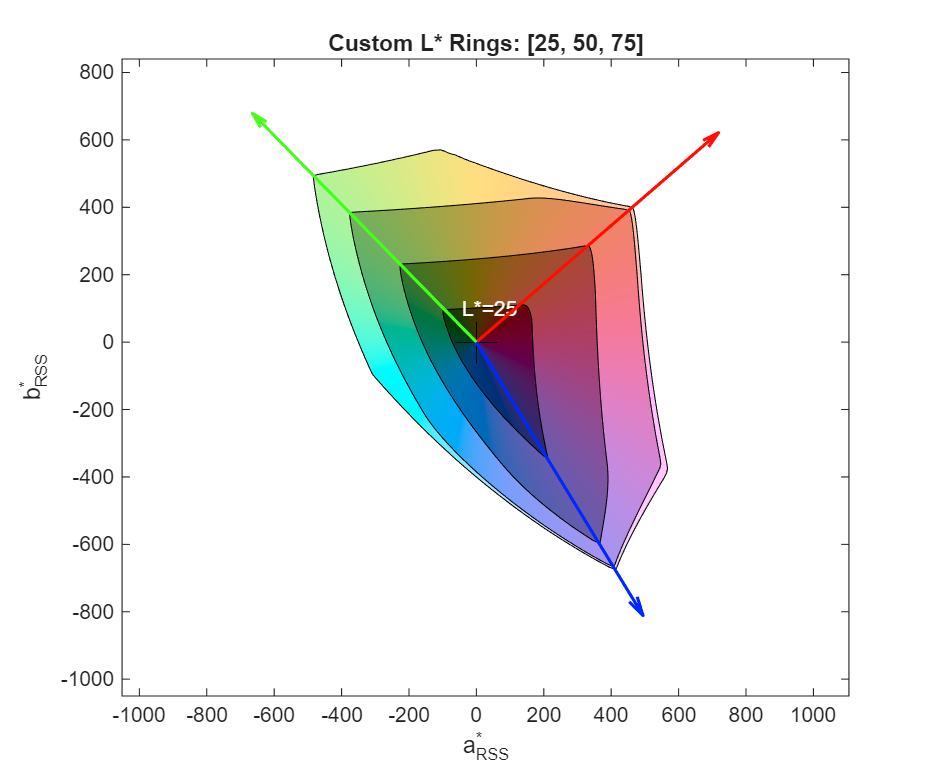

### LLabelIndices

Which rings to label with L* values.

| Parameter | Description | Default |
|-----------|-------------|---------|
| `LLabelIndices` | Indices into `[LRings, 100]` | `[1, 5]` |

```matlab
% Label all rings
PlotRings(gamut, 'LLabelIndices', 1:10);

% No labels
PlotRings(gamut, 'LLabelIndices', []);
```

### LLabelColors

Colors for L* labels.

| Parameter | Description | Default |
|-----------|-------------|---------|
| `LLabelColors` | Color specification | `'default'` |

Values:
- `'default'` - Inner labels white, outer label black
- Color name (e.g., `'red'`)
- RGB triplet (e.g., `[1 0 0]`)
- Cell array of colors
- N x 3 matrix of RGB values

```matlab
PlotRings(gamut, 'LLabelColors', 'blue');
PlotRings(gamut, 'LLabelColors', [1 0.5 0; 0 0.5 1]);
```

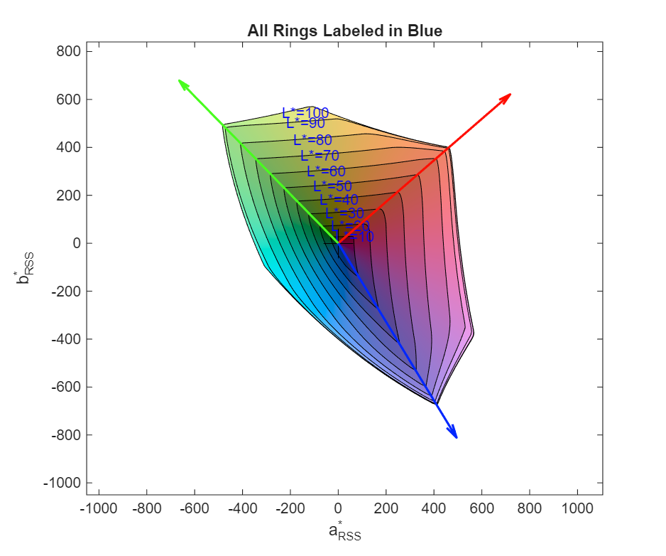

### Line Styles

| Parameter | Description | Default |
|-----------|-------------|---------|
| `RingLine` | Line style for gamut rings | `'k'` |
| `RefLine` | Line style for first reference | `'--k'` |
| `Ref2Line` | Line style for second reference | `':k'` |

```matlab
PlotRings(gamut, ref, 'RingLine', 'b', 'RefLine', '--r');
```

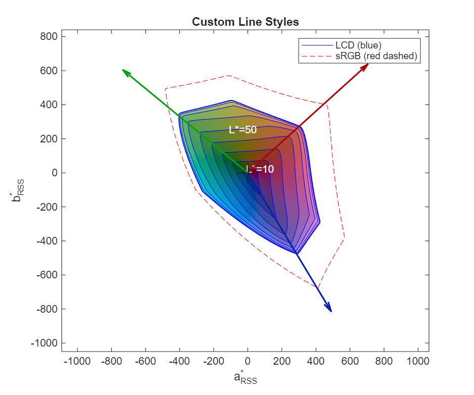

### IntersectionPlot

Show the intersection of test and reference gamuts instead of overlaid rings.

| Parameter | Description | Default |
|-----------|-------------|---------|
| `IntersectionPlot` | Enable intersection mode | `false` |
| `IntersectionLine` | Line style for intersection | `''` |
| `IntersectGamuts` | Intersect gamuts before display | `false` |

```matlab
PlotRings(SyntheticGamut('sRGB'), SyntheticGamut('BT.2020'), ...
    'IntersectionPlot', true);
```

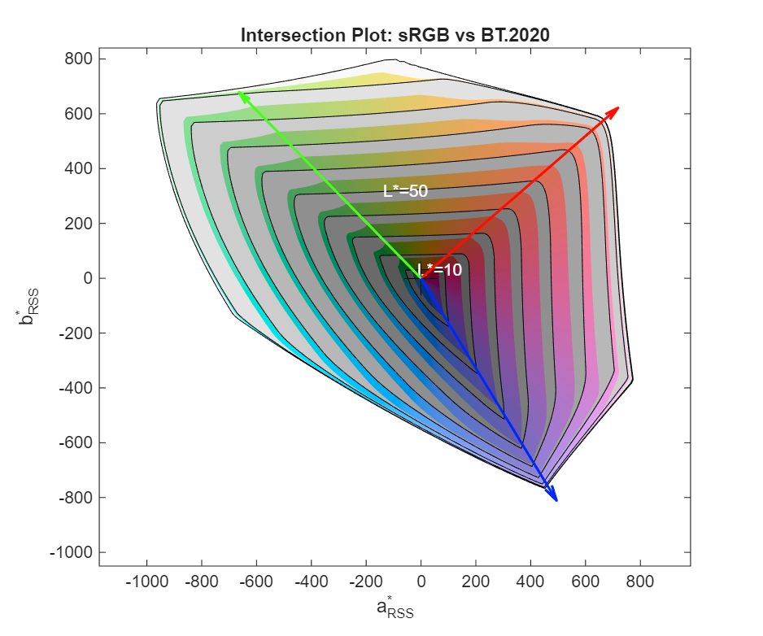

### RingReference

How the reference gamut is shown on each ring.

| Parameter | Description | Default |
|-----------|-------------|---------|
| `RingReference` | Reference display mode | `'none'` |

Values:
- `'none'` - Only show reference at L*=100
- `'intersection'` - Show intersection per ring
- `'ref'` - Show reference at each L* level

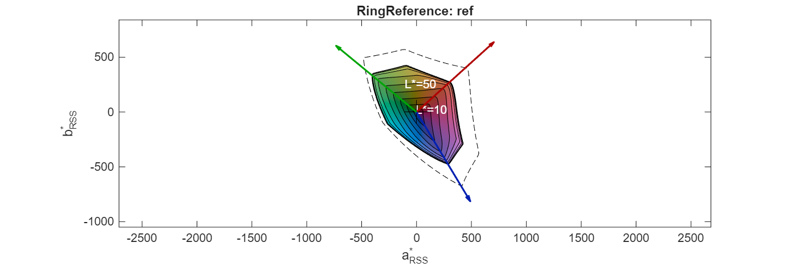

---

## Gamut Bands

Colored regions between rings that visualize hue and lightness.

### ShowBands

| Parameter | Description | Default |
|-----------|-------------|---------|
| `ShowBands` | Display colored bands | `true` |

```matlab
PlotRings(gamut, 'ShowBands', false);  % Lines only
```

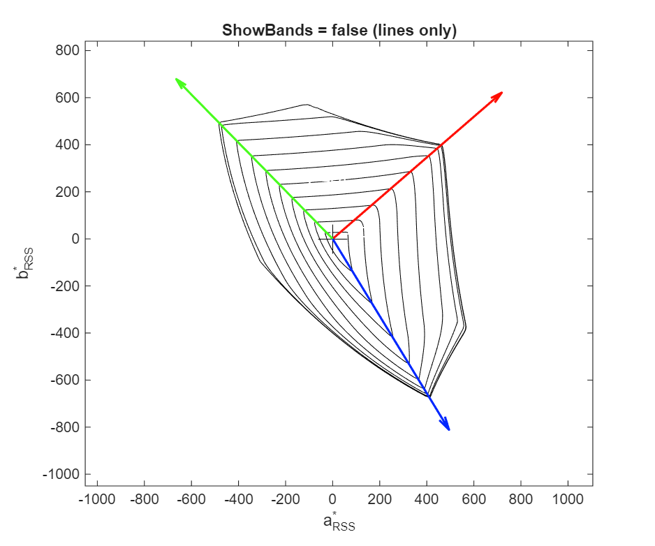

### BandChroma

Saturation of band colors.

| Parameter | Description | Default |
|-----------|-------------|---------|
| `BandChroma` | Chroma value (0 = grayscale) | `50` |

```matlab
% Grayscale bands
PlotRings(gamut, 'BandChroma', 0);

% Highly saturated bands
PlotRings(gamut, 'BandChroma', 100);
```

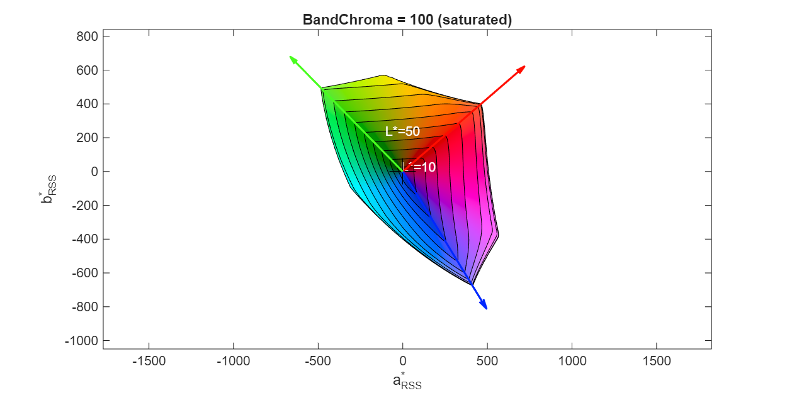

### BandLs

Lightness values for bands.

| Parameter | Description | Default |
|-----------|-------------|---------|
| `BandLs` | Lightness range or per-band values | `[20 90]` |

If 2 values: min and max lightness, interpolated across bands.
If N values: explicit lightness for each band.

### BandHue

Hue of the bands.

| Parameter | Description | Default |
|-----------|-------------|---------|
| `BandHue` | Fixed hue (0-359) or `'match'` | `'match'` |

- `'match'` - Hue follows the hue angle on the chart
- `0-359` - Fixed hue for all bands

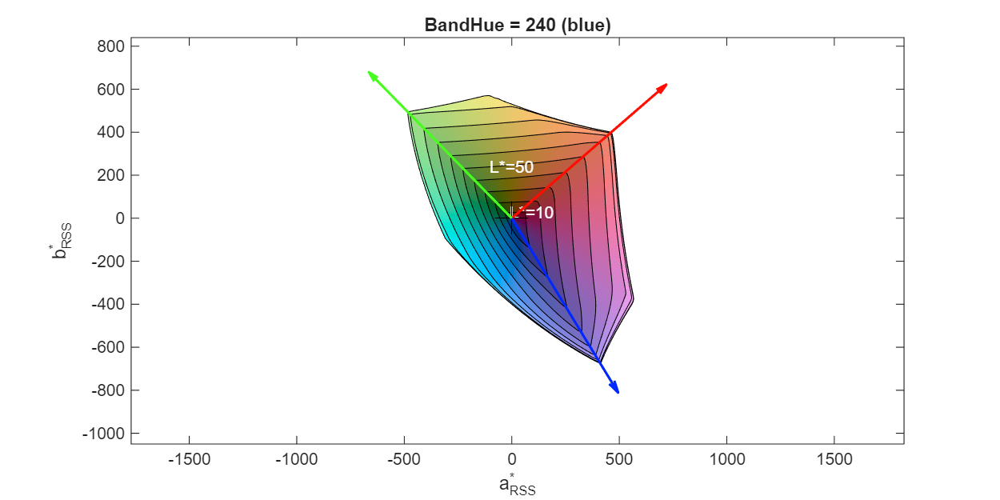

### Reference Bands

When a reference gamut is provided, additional bands show the reference extent.

| Parameter | Description | Default |
|-----------|-------------|---------|
| `ShowRefBands` | Show reference bands | `true` |
| `RefBandChroma` | Reference band chroma | `0` |
| `RefBandLs` | Reference band lightness | `[30 98]` |
| `RefBandHue` | Reference band hue | `'match'` |

---

## Decorations

### Center Mark

| Parameter | Description | Default |
|-----------|-------------|---------|
| `CentMark` | Line spec for center marker | `'+k'` |
| `CentMarkSize` | Marker size | `20` |

```matlab
PlotRings(gamut, 'CentMark', 'xr', 'CentMarkSize', 30);
PlotRings(gamut, 'CentMark', []);  % No center mark
```

### ChromaRings

Circles at constant chroma (RSS) values.

| Parameter | Description | Default |
|-----------|-------------|---------|
| `ChromaRings` | Vector of chroma values | `[]` |

```matlab
PlotRings(gamut, 'ChromaRings', [500, 1000]);
```

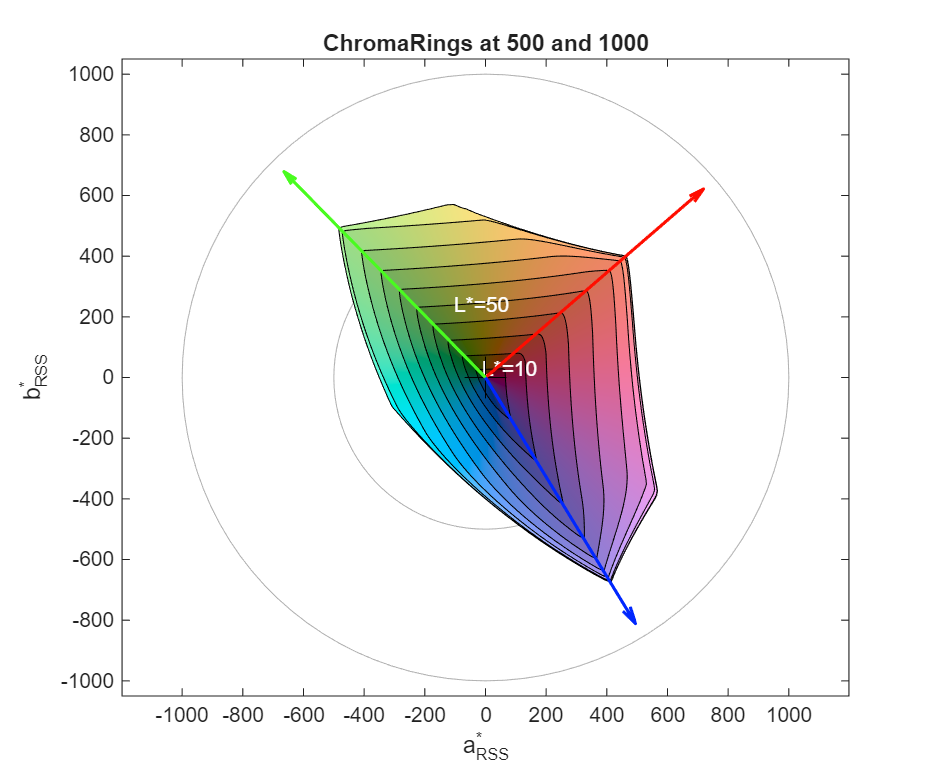

---

## Primary Color Indicators

Arrows showing the hue angles of primary colors.

### Primaries

| Parameter | Description | Default |
|-----------|-------------|---------|
| `Primaries` | Which primaries to show | `'rgb'` |

Values:
- `'none'` - No primary indicators
- `'rgb'` - Red, Green, Blue only
- `'all'` - RGBCMY (all six primaries)

```matlab
PlotRings(gamut, 'Primaries', 'all');
```

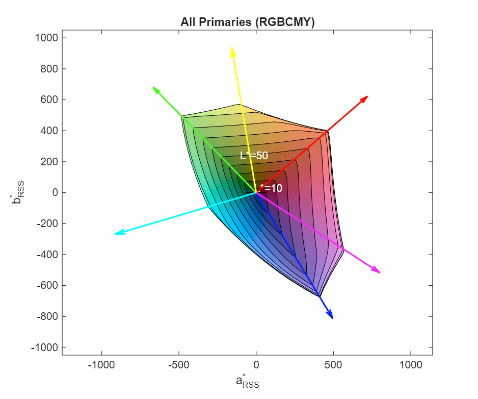

### PrimaryColor / PrimaryColour

Arrow head color source.

| Parameter | Description | Default |
|-----------|-------------|---------|
| `PrimaryColor` | Color source | `'output'` |

Values:
- `'output'` - Use measured/calculated color
- `'input'` - Use nominal RGB color

### PrimaryChroma

Radius of primary arrow heads.

| Parameter | Description | Default |
|-----------|-------------|---------|
| `PrimaryChroma` | Chroma value or `'auto'` | `950` |

`'auto'` sets it to max ring chroma + 100.

### PrimaryOrigin

Starting point for primary arrows.

| Parameter | Description | Default |
|-----------|-------------|---------|
| `PrimaryOrigin` | `'centre'` or `'ring'` | `'centre'` |

- `'centre'` / `'center'` - Arrows start from origin
- `'ring'` - Arrows start from L*=100 ring

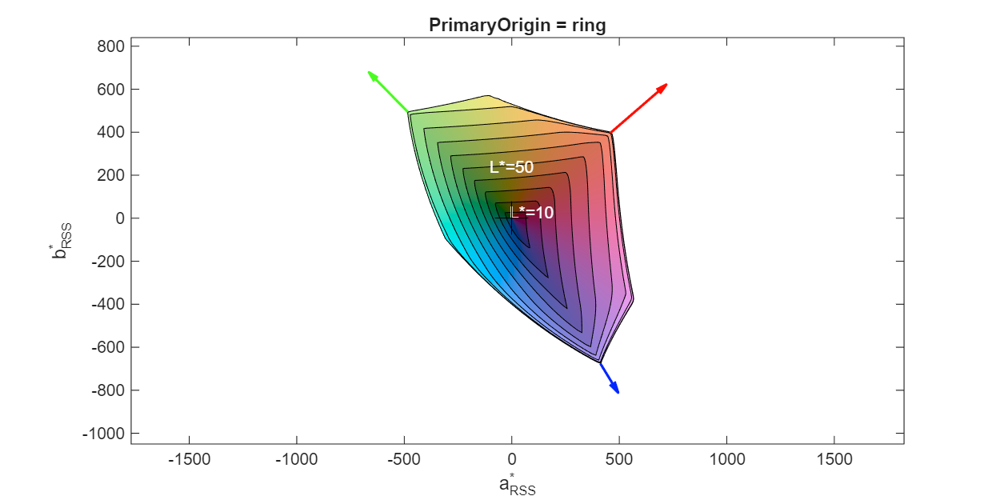

### Reference Primaries

| Parameter | Description | Default |
|-----------|-------------|---------|
| `RefPrimaries` | Which reference primaries to show | `'none'` |
| `RefPrimaryChroma` | Reference arrow head radius | `'auto'` |
| `RefPrimaryOrigin` | Reference arrow start point | `'ring'` |

```matlab
PlotRings(gamut, ref, 'Primaries', 'all', 'RefPrimaries', 'all');
```

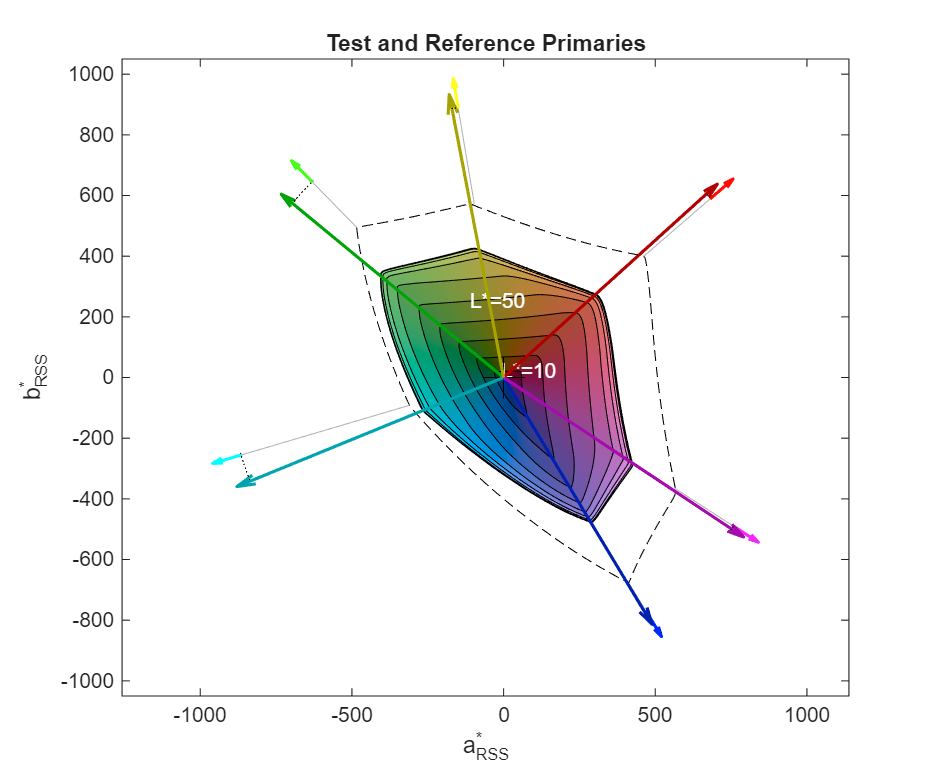

---

## Scatter Point Data

Overlay Lab data points on the rings plot.

| Parameter | Description | Default |
|-----------|-------------|---------|
| `ScatterData` | N x 3 matrix of [L*, a*, b*] values | `[]` |

```matlab
% Random Lab points
scatter_lab = rand(100, 3) .* [100, 200, 200] - [0, 100, 100];
PlotRings(gamut, 'ScatterData', scatter_lab);
```

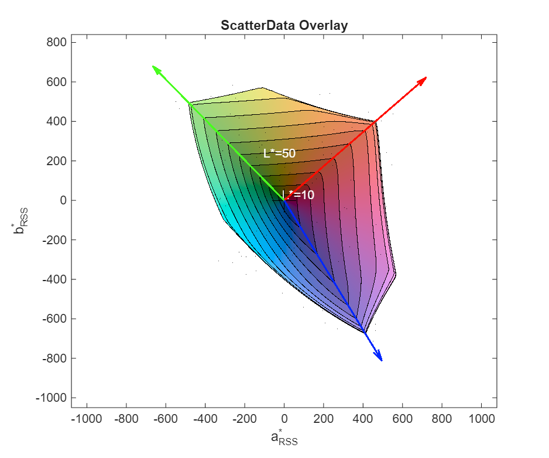

---

## Complete Examples

### Basic Comparison

```matlab
gamut = CIELabGamut('samples/lcd.txt');
ref = SyntheticGamut('sRGB');

figure;
PlotRings(gamut, ref);
legend('LCD', 'sRGB');
```

### Advanced Customization

```matlab
gamut = CIELabGamut('samples/lcd.txt');
ref = SyntheticGamut('sRGB');

PlotRings(gamut, ref, ...
    'LLabelIndices', [], ...           % No labels
    'RingReference', 'intersection', ... % Show intersection per ring
    'ChromaRings', 1000, ...           % Add chroma circle
    'Primaries', 'all', ...            % Show RGBCMY
    'RefPrimaries', 'all');            % Reference primaries too
```

### Side-by-Side Comparison

```matlab
figure;

subplot(1, 3, 1);
PlotRings(SyntheticGamut('sRGB'));
title('sRGB');

subplot(1, 3, 2);
PlotRings(SyntheticGamut('DCI-P3'));
title('DCI-P3');

subplot(1, 3, 3);
PlotRings(SyntheticGamut('BT.2020'));
title('BT.2020');
```

---

## See Also

- [CIELabGamut](CIELabGamut.md) - Load gamut data
- [SyntheticGamut](SyntheticGamut.md) - Generate reference gamuts
- [PlotVolume](PlotVolume.md) - 3D visualization
- [GetVolume](GetVolume.md) - Calculate volume
- [IntersectGamuts](IntersectGamuts.md) - Compute intersections
