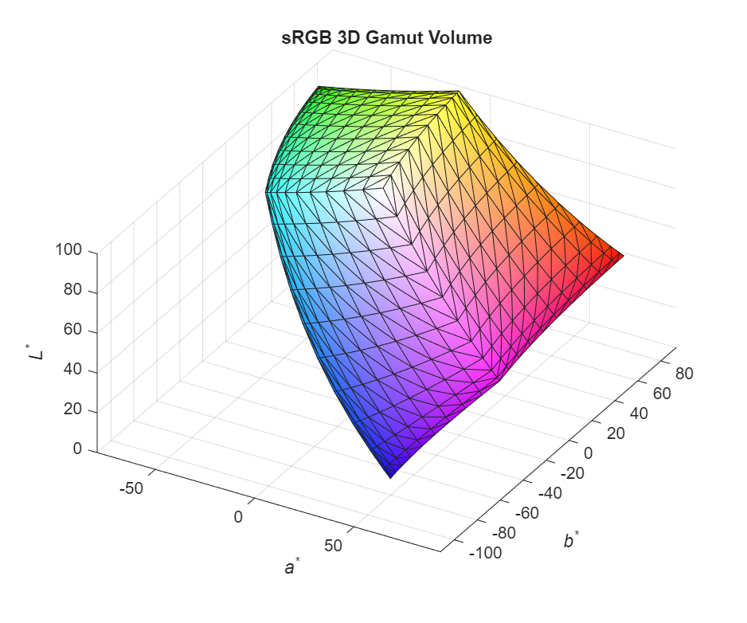
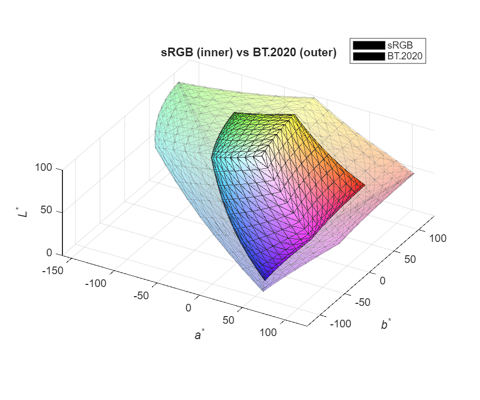

# PlotVolume

Create a 3D surface visualization of a CIELab gamut.

## Syntax

```matlab
h = PlotVolume(gamut)
h = PlotVolume(gamut, alpha)
```

## Description

`PlotVolume` renders a 3D surface plot of the gamut volume in CIELab color space. The surface is colored using the RGB values of each point, providing an intuitive visualization of the color space.

## Input Arguments

| Argument | Description |
|----------|-------------|
| `gamut` | Gamut object from `CIELabGamut` or `SyntheticGamut` |
| `alpha` | Surface opacity (0-1) | `1` (opaque) |

**Note:** Gamuts from `IntersectGamuts` cannot be plotted with this function as they lack surface tessellation data.

## Return Value

| Value | Description |
|-------|-------------|
| `h` | Handle to the surface plot object |

## Examples

### Basic 3D Plot

```matlab
gamut = SyntheticGamut('sRGB');
figure;
PlotVolume(gamut);
```



### Compare Two Gamuts

```matlab
srgb = SyntheticGamut('sRGB');
bt2020 = SyntheticGamut('BT.2020');

figure;
PlotVolume(srgb);
hold on;
PlotVolume(bt2020, 0.2);  % Transparent outer gamut
title('sRGB (inner) vs BT.2020 (outer)');
```



### Custom View Angle

```matlab
gamut = SyntheticGamut('DCI-P3');
figure;
h = PlotVolume(gamut);
view([45 20]);  % Azimuth 45, elevation 20
```

### Multiple Gamuts

```matlab
figure;
hold on;

PlotVolume(SyntheticGamut('sRGB'));
PlotVolume(SyntheticGamut('DCI-P3'), 0.3);
PlotVolume(SyntheticGamut('BT.2020'), 0.1);

legend('sRGB', 'DCI-P3', 'BT.2020');
view([30 25]);
```

### Measured vs Reference

```matlab
gamut = CIELabGamut('samples/lcd.txt');
ref = SyntheticGamut('sRGB');

figure;
PlotVolume(gamut);
hold on;
PlotVolume(ref, 0.2);
legend('LCD', 'sRGB reference');
```

## Plot Details

The generated plot includes:
- Surface colored by RGB values
- Axis labels: a*, b*, L*
- Title showing gamut name and volume
- Equal aspect ratio axes
- Default view angle of [30, 30]

## Customization

After plotting, you can customize using standard MATLAB graphics:

```matlab
h = PlotVolume(gamut);

% Change title
title('My Custom Title');

% Change view
view([60 30]);

% Modify surface properties
h.EdgeAlpha = 0;      % Hide edges
h.FaceLighting = 'gouraud';

% Add lighting
camlight;
```

## Axis Labels

The axes represent:
- **X-axis (a*)**: Green-Red axis (-100 to +100 typical)
- **Y-axis (b*)**: Blue-Yellow axis (-100 to +100 typical)
- **Z-axis (L*)**: Lightness (0 to 100)

## See Also

- [PlotRings](PlotRings.md) - 2D gamut rings visualization
- [CIELabGamut](CIELabGamut.md) - Load gamut data
- [SyntheticGamut](SyntheticGamut.md) - Generate reference gamuts
- [GetVolume](GetVolume.md) - Calculate gamut volume
