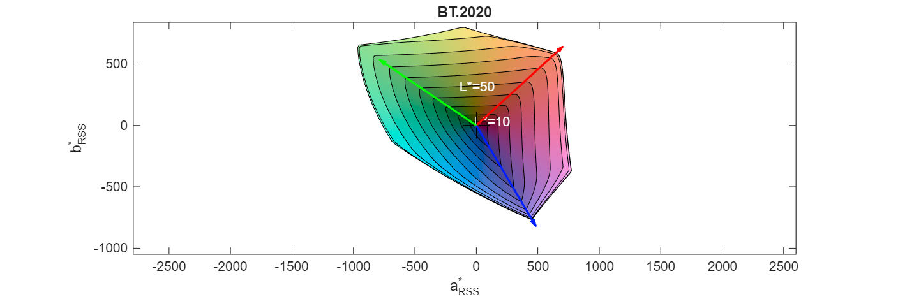

# SyntheticGamut

Generate a synthetic display gamut from standard references or custom primaries.

## Syntax

```matlab
gamut = SyntheticGamut(referenceName);
gamut = SyntheticGamut(RGBxy);
gamut = SyntheticGamut(RGBxy, white);
gamut = SyntheticGamut(RGBxy, driveMapping);
gamut = SyntheticGamut(RGBxy, white, driveMapping);
gamut = SyntheticGamut(colorantXYZ, driveMapping);
gamut = SyntheticGamut(___, 'parameter', value, ...);
```

## Description

`SyntheticGamut` creates a mathematically perfect gamut for reference comparisons. Use it to generate standard color spaces or simulate custom display configurations.

## Standard Reference Gamuts

| Name | Description | White Point | Gamma |
|------|-------------|-------------|-------|
| `'sRGB'` | Standard RGB (web, consumer displays) | D65 | sRGB transfer |
| `'BT.2020'` | Ultra HD / HDR television | D65 | 2.4 |
| `'DCI-P3'` | Digital cinema | DCI white | 2.4 |
| `'D65-P3'` | Display P3 (Apple devices) | D65 | 2.4 |
| `'D60-P3'` | P3 with D60 white point | D60 | 2.4 |

## Standard White Points

| Name | CIE xy |
|------|--------|
| `'D50'` | (0.3457, 0.3585) |
| `'D55'` | (0.3324, 0.3474) |
| `'D60'` | (0.32168, 0.33767) |
| `'D65'` | (0.3127, 0.3290) |
| `'D75'` | (0.2990, 0.3149) |
| `'DCI-P3'` | (0.314, 0.351) |

## Input Arguments

| Argument | Description |
|----------|-------------|
| `referenceName` | Standard gamut name (see table above) |
| `RGBxy` | 3x2 matrix of CIE 1931 xy chromaticities [R; G; B] |
| `white` | White point as xy pair or name (e.g., `'D65'`) |
| `driveMapping` | Function to map RGB to drive signals |
| `colorantXYZ` | Nx3 matrix of colorant XYZ values |

## Parameters

| Parameter | Description | Default |
|-----------|-------------|---------|
| `Gamma` | Scalar gamma value or transfer function | 2.4 (or standard-specific) |
| `Black` | Black point xy chromaticity | Same as white |
| `BlackRatio` | Black luminance / white luminance | 0 |
| `Steps` | RGB cube edge resolution | 10 |
| `Name` | Gamut name for plots | Reference name or `'Synthetic Gamut'` |

## Examples

### Use Standard Reference

```matlab
srgb = SyntheticGamut('sRGB');
bt2020 = SyntheticGamut('BT.2020');
```

### Compare Reference Volumes

```matlab
srgb_vol = GetVolume(SyntheticGamut('sRGB'));
bt2020_vol = GetVolume(SyntheticGamut('BT.2020'));
fprintf('BT.2020 is %.1fx larger than sRGB\n', bt2020_vol / srgb_vol);
```

### Custom Primaries

```matlab
% Define RGB primaries as xy chromaticities
primaries = [0.68, 0.32;   % Red
             0.265, 0.69;  % Green
             0.15, 0.06];  % Blue

gamut = SyntheticGamut(primaries, 'D65');
```

### White Point Comparison

```matlab
primaries = [0.68, 0.32; 0.265, 0.69; 0.15, 0.06];

d50_gamut = SyntheticGamut(primaries, 'D50');
d65_gamut = SyntheticGamut(primaries, 'D65');

fprintf('D50 white point volume: %g\n', GetVolume(d50_gamut));
fprintf('D65 white point volume: %g\n', GetVolume(d65_gamut));
```

### Custom Gamma

```matlab
% Power law gamma
gamut = SyntheticGamut('sRGB', 'Gamma', 2.2);

% Custom transfer function
gamut = SyntheticGamut(primaries, 'D65', 'Gamma', @(v) v.^2.4);
```

### RGBW Display Simulation

Simulate a white-boosted RGBW display:

```matlab
primaries = [0.64, 0.33; 0.3, 0.6; 0.15, 0.06];

for wb = 0:0.25:1
    % Map RGB to RGBW with white boost
    mapping = @(s) [s, wb * min(s, [], 2)];
    gamut = SyntheticGamut(primaries, mapping);
    fprintf('White boost %g%%: volume = %g\n', wb * 100, GetVolume(gamut));
end
```

### Multi-Primary Display

For displays with more than RGB primaries:

```matlab
% Define colorant XYZ values directly
colorantXYZ = [
    41.2, 21.3, 1.9;    % Red
    35.8, 71.5, 11.9;   % Green
    18.0, 7.2, 95.0;    % Blue
    95.0, 100, 108.9;   % White
    50.0, 60.0, 5.0     % Yellow
];

% Mapping function: RGB -> 5 colorants
mapping = @(rgb) [rgb, min(rgb, [], 2), min(rgb(:,1:2), [], 2)];

gamut = SyntheticGamut(colorantXYZ, mapping);
```

### Black Level Simulation

```matlab
% Simulate contrast ratio of 1000:1
gamut = SyntheticGamut('sRGB', 'BlackRatio', 1/1000);
```

## Drive Mapping Functions

The `driveMapping` function transforms linear RGB values to display colorant drive levels:

```matlab
% Input: Mx3 matrix of RGB values (0-1 range)
% Output: MxN matrix of drive signals for N colorants

% Identity (standard RGB)
mapping = @(rgb) rgb;

% RGBW with white boost
wb = 0.5;  % 50% white boost
mapping = @(rgb) [rgb, wb * min(rgb, [], 2)];
```

## Visualization

```matlab
% Compare three standards
figure;
subplot(1,3,1);
PlotRings(SyntheticGamut('sRGB'));
title('sRGB');

subplot(1,3,2);
PlotRings(SyntheticGamut('DCI-P3'));
title('DCI-P3');

subplot(1,3,3);
PlotRings(SyntheticGamut('BT.2020'));
title('BT.2020');
```



## See Also

- [CIELabGamut](CIELabGamut.md) - Load measured gamut data
- [GetVolume](GetVolume.md) - Calculate volume
- [PlotRings](PlotRings.md) - 2D visualization
- [IntersectGamuts](IntersectGamuts.md) - Compare gamuts
