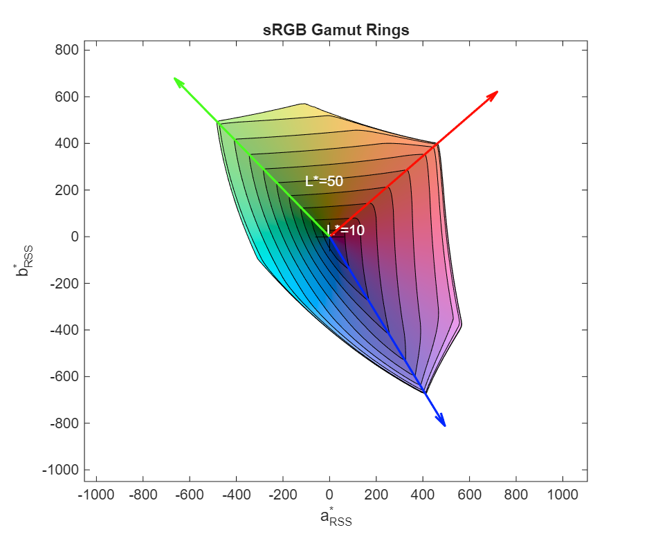

# CIELab Gamut Volume Toolkit Documentation

Welcome to the documentation for the CIELab gamut volume calculation and visualization toolkit for MATLAB/Octave.

## Quick Links

- [Getting Started](getting-started.md) - Installation and first steps
- [CGATS File Format](guides/cgats-file-format.md) - Input file format specification

## Function Reference

### Core Functions

| Function | Description |
|----------|-------------|
| [CIELabGamut](functions/CIELabGamut.md) | Build gamut from CGATS files or RGB/XYZ matrices |
| [SyntheticGamut](functions/SyntheticGamut.md) | Generate standard reference gamuts |
| [GetVolume](functions/GetVolume.md) | Calculate gamut volume |
| [IntersectGamuts](functions/IntersectGamuts.md) | Compute intersection of two gamuts |

### Visualization

| Function | Description |
|----------|-------------|
| [PlotRings](functions/PlotRings.md) | 2D gamut rings visualization (30+ parameters) |
| [PlotVolume](functions/PlotVolume.md) | 3D surface visualization |

## Common Workflows

### Calculate Gamut Coverage

```matlab
% Load test gamut
gamut = CIELabGamut('samples/lcd.txt');

% Create reference
ref = SyntheticGamut('sRGB');

% Calculate coverage percentage
intersection = IntersectGamuts(gamut, ref);
coverage = GetVolume(intersection) / GetVolume(ref) * 100;
fprintf('sRGB coverage: %.1f%%\n', coverage);
```

### Compare Reference Standards

```matlab
% Compare BT.2020 to sRGB
srgb_vol = GetVolume(SyntheticGamut('sRGB'));
bt2020_vol = GetVolume(SyntheticGamut('BT.2020'));
fprintf('BT.2020 is %.1fx larger than sRGB\n', bt2020_vol / srgb_vol);
```

### Visualize Gamut

```matlab
gamut = CIELabGamut('samples/lcd.txt');
ref = SyntheticGamut('sRGB');

% 2D rings plot
figure;
PlotRings(gamut, ref);

% 3D volume plot
figure;
PlotVolume(gamut);
```

## Image Gallery

### Basic Plots

| Image | Description |
|-------|-------------|
|  | Single gamut rings |
|  | Gamut vs sRGB reference |
|  | 3D volume visualization |
|  | sRGB vs BT.2020 overlay |

### PlotRings Options

| Image | Description |
|-------|-------------|
|  | Custom L* values |
|  | IntersectionPlot mode |
|  | Constant chroma circles |
|  | RGBCMY primary arrows |

See individual function documentation for more examples.

## Platform Support

- **MATLAB**: Full support
- **GNU Octave**: Partial support (tests are MATLAB-only)

## Additional Resources

- [GitHub Repository](https://github.com/CIELab-gamut-tools/gamut-volume-m)
- [Issue Tracker](https://github.com/CIELab-gamut-tools/gamut-volume-m/issues)
